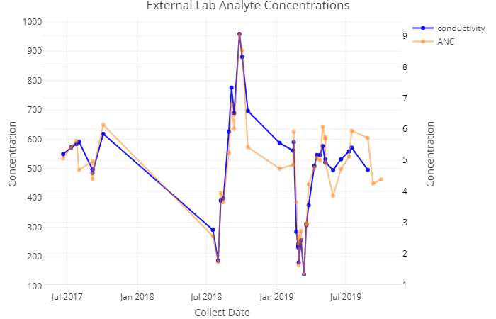

# Analyte Comparison (v1.0)

#### Timothy Gilbert (tsgilbert90@gmail.com)

## Background

This Shiny app uses [National Ecological Observatory Network 'NEON'](https://data.neonscience.org/data-products/explore) data to compare analyte concentrations measured using [Surface Water Chemistry](https://data.neonscience.org/data-products/DP1.20093.001#about) sampling across various [NEON sites](https://www.neonscience.org/field-sites/field-sites-map) across the United States. More information on the data collection process can be found by clicking on [Surface Water Chemistry](https://data.neonscience.org/data-products/DP1.20093.001#about) anywhere in this document <!-- Two spaces apart -->


## Comparison

This app allows you to select an Aquatic Field site and two analytes to compare, one '**main**' and a second one. The data is pulled from the NEON database from 2016-01 until most recent data and plotted through time on a dual y-axis plot. The plot auto scales to allow for pattern detection between various analytes.




## Analysis

The Analysis tab plots out the two selected analyte concentrations through linear regression (lm). Below that the summary is taken for the relationship between the two analytes and the P-value is printed out. Data points are paired by collection date of sample taken.

```{r, eval=FALSE}
    # portion of code for plotting linear regression of two analytes
    sct_base<-ggplot(analytes,aes(y = analyteConcentration.y,x = analyteConcentration.x))
    d.plot<- sct_base+geom_point()+
      geom_smooth(method = "lm",se = F, color = "Red", show.legend = T, formula = 'y ~ x', na.rm = F)+
      geom_smooth(color = "Grey", show.legend = T, inherit.aes = T)+
      theme_classic()+
      ggtitle(paste0(analytes$analyte.y[1],' vs ',analytes$analyte.x[1]))+
      xlab(analytes$analyte.x[1])+
      ylab(analytes$analyte.y[1])
    
    # portion of code for summary of linear regression (for P-value)
    mdl_1<-lm(analyteConcentration.y ~ analyteConcentration.x,data = analytes)
    summary(mdl_1)
```

_Due to some samples having replicates collected on the same day, plotting the same analyte by the exact same analyte may not yield a perfect linear line do to slight variation_

## Correlation Report

The Correlation Report tab uses the '**main**' analyte chosen and calculates correlation compared to every other analyte independently.


```{r, eval=FALSE}
# list of analyes being evaluated
alist<- c('ANC','Br','Ca','Cl','CO3','conductivity','DIC','DOC','F','Fe','HCO3','K','Mg','Mn','Na','NH4 - N','NO2 - N','NO3+NO2 - N','Ortho - P','pH','Si','SO4','TDN','TDP','TDS','TN','TOC','TP','TPC','TPN','TSS','TSS - Dry Mass','UV Absorbance (250 nm)','UV Absorbance (280 nm)')
    
    # empty table to store correlation results
    correlation <- data.table(Analyte=character(),Correlation=numeric())

    # main analyte selected data
    analyte_data<- External.data %>%
      filter(analyte == select.analyte) %>%
      select(analyte, analyteConcentration, collectDate) %>%
      arrange(collectDate)
    
    i=1
    while (i < length(alist)+1 ) {
      # goes through all analytes and saves data
      analyte_dataB<- External.data %>%
        filter(analyte == alist[i]) %>%
        select(analyte, analyteConcentration, collectDate) %>% 
        arrange(collectDate)
      # joins analyte data together by collect date
      analytes<- left_join(analyte_data, analyte_dataB, by= 'collectDate')
      
      # saves correlation # into table
      correlation[[i,2]]<- cor(analytes$analyteConcentration.x, analytes$analyteConcentration.y)
      # saves 2nd analyte being evaluated into table
      correlation[[i,1]]<- paste0(analytes$analyte.y[1])
      i=i+1
    }
    # organizing data
    correlation<- correlation %>%
      arrange(desc(Correlation))
    
    i=1
    # if no value is produced...
    while (i < length(alist)+1 ) {
    if(is.na(correlation[[i,2]])) {
      correlation[[i,2]]<- ('Not enough data')
    }
      i=i+1
    }
    # take out 'main' analyte that is being compared to the rest
    correlationA<- correlation %>%
      filter(Analyte != select.analyte)
```

_Some sites may not have enough data points for certain analytes and do not produce a correlation result. Therefore the table will print 'Not enough data'_


## Data Table

The Data Table tab shows the actual data being plotted for the Analysis Tab with collection dates included.


## MLR Model

_IN PROGRESS_
<!--- three spaces --->
The MLR(Machine Learning) Model tab uses the main analyte as its predictor value. It takes all Surface Water Chemistry data provided from all the sites and tries to predict the value for the 'main' analyte if all other analyte values were provided. This tab only shows the predicting value test results for now.

```{r, eval=FALSE}
    # defining a task (what want to achieve) - Target is variable trying to predict
    ANCTask <- makeRegrTask(data = f_data, target = select.analyte)
    # choose a Learner for model- regression
    lm <- makeLearner('regr.glm', predict.type = 'response')
    # must define task, learner, and train model
    lmModel<- train(lm, ANCTask)
    
    # cross validation testing w/ 10 fold and 50 reps
    kFold<- makeResampleDesc("RepCV", fold = 10, reps = 40) # repeat cross validation ('Re
    kFoldCV<- resample(learner = lm, task = ANCTask, resampling = kFold)
    # test results - % of how often would get value right
    mse.test.mean<- kFoldCV$aggr
    mse<- (1-mse.test.mean)*100
    
    if (mse > 0) {
    results<- print(paste0(select.analyte, " can be predicted with present analyte data present within ~", round(mse, 2), "% of the time (data from all sites)"))
    }
    
    if (mse < 0) {
    results<- print(paste0(select.analyte, " CANNOT be predicted with present analyte data: ~", round(mse, 2), "% value returned"))
    }
    
    results
```

_Improvements want to be made for this section. Prehaps changing the machine learning model to assign a water quality tag (Great, Good, Okay, Bad, Terrible) based on a water quality assessment_


## Analytes Avaliable in App

+ 'Acid Neutralizing Capacity(ANC)'='ANC'
+ 'Bicarbonate Concentration(Br)'='Br'
+ 'Calcium Concentration(Ca)'='Ca'
+ 'Chlorine Concentration(Cl)'='Cl'
+ 'Carbonate Concentration(C)'='CO3'
+ 'Conductivity'='conductivity'
+ 'Dissolved Inorganic Carbon(DIC)'='DIC'
+ 'Dissolved Organic Carbon(DOC)'='DOC'
+ 'Fluorine Concentration(F)'='F'
+ 'Iron Concentration(Fe)'='Fe'
+ 'Bicarbonate Concentration(HCO3)'='HCO3'
+ 'Potassium Concentration(K)'='K'
+ 'Magnesium Concentration(Mg)'='Mg'
+ 'Manganese Concentration(Mn)'='Mn'
+ 'Sodium Concentration(Na)'='Na'
+ 'Ammonium Concentration(NH4)'='NH4 - N'
+ 'Nitrogen Dioxide(NO2-N)'='NO2 - N'
+ 'Nitrate(NO3+NO2-N)'='NO3+NO2 - N'
+ 'Orthophosphate Concentration(Ortho-P)'='Ortho - P'
+ 'pH(pH)'='pH','Silica Concentration(Si)'='Si'
+ 'Sulfate Concentrations(SO4)'='SO4'
+ 'Total Dissolved Nitrogen(TDN)'='TDN'
+ 'Total Dissolved Phosphorus(TDP)'='TDP'
+ 'Total Dissolved Solids(TDS)'='TDS'
+ 'Total Nitrogen(TN)'='TN'
+ 'Total Organic Carbon(TOC)'='TOC'
+ 'Total Phosphorus(TP)'='TP'
+ 'Total Particulate Carbon(TPC)'='TPC'
+ 'Total Particulate Nitrogen(TPN)'='TPN'
+ 'Total Suspended Solids(TSS)'='TSS'
+ 'Dry Mass Suspended Solids(TSS-D)'='TSS - Dry Mass'
+ 'UV Absorbance (250 nm)'
+ 'UV Absorbance (280 nm)'


## Limitations

Samples must have same collection date to be compared so results are not comprehensive. Initial download can take a couple minutes, but once downloaded, app can seamlessly transition to new analyte comparisons for the same site. If new site is selected, app will have to initiate download process again.
